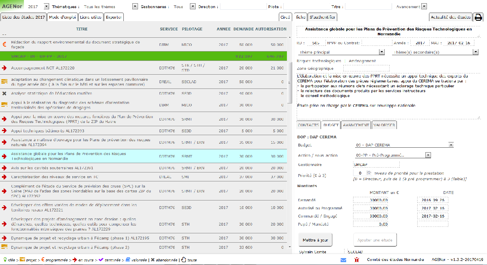
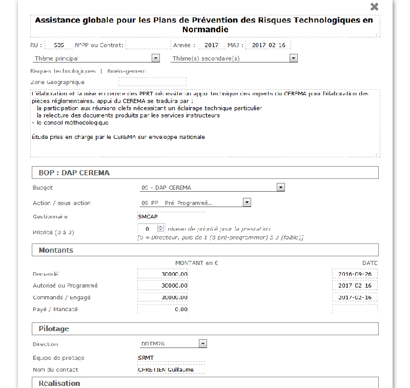

*Le [projet original][origin] est hébergé sur [l'instance gitlab de Framasoft][framagit]. D'autres versions peuvent être déployées, notamment sur gitlab ou github, mais il s'agit de mirroirs...*

# AGENor - Application de Gestion des Etudes Normandie
Cet **outil de suivi des études** a été conçu pour faciliter la programmation, le suivi et la valorisation des études dans les services du ministère du développement durable en Normandie. Se référer à la documentation et notamment au [flux de production][doc-flux-prod] pour comprendre la logique de fonctionnement de l'outil et la terminologie employée.

Les rapports de bugs et autres commentaires peuvent se faire soit directement depuis l'application (si vous en avez une instance qui tourne), soit [depuis le dépôt original][issues]

## Installation (bonne chance!)
*ces instructions sont largement incomplètes et feront l'objet d'amendements au fur à mesure des expériencees*

* Construction et mise en place de la base de donnéesde la [base de données][doc-database]. Il est recommandé d'utiliser le dump figurant dans les sources pour disposer de la structure à jour (en cours d'évolution)
* Ajout du [script postgresql][script-postgre] pour la génération des tableaux dans les procédure postgre
* Plusieurs tables sont à nourrir pour pouvoir démarrer (cf. documentation). Pour l'heure c'est à faire directement depuis l'interface postgre
* Installation des fichiers sur le serveur

## Pré-requis (à compléter)
* serveur *type de serveur?* avec
 * PHP *version nécessaire?*
  * *modules indispensables éventuels*
 * Postgresql *version nécessaire?*

## Sources utilisées / licences
*la licence n'est pas choisie à ce jour. Une réflexion est en cours*

## Crédits
Le projet utilise
* [normalize.css](http://necolas.github.io/normalize.css) *4.1.1*
* [font-awesome](http://fontawesome.io) *4.6.2*
* [pgi](http://sycom.gitlab.io/post-Gitlab-issues/) *0.1.1*
* [jQuery](http://jquery.com/) *1.12.0*

Imaginé et construit par
* Fouad Gafsi (DDTM Seine-Maritime)
* Sylvain Comte (DREAL Normandie)

## Circuit
* **[Framagit][origin]** ([issues][issues])
   * *documentation* > [documentation][doc] (markdown)
   * [Gitlab][gitlab] > *documentation* > [documentation][documentation] (page web)
      * [Github][github]

[origin]:https://framagit.org/know-rmandie/AGENor
[doc]:doc/index.md
[doc-flux-prod]:doc/flux-production.md
[doc-database]:doc/database.md
[documentation]:http://know-rmandie.gitlab.io/AGENor/
[script-postgre]:postgresql/tableau-format.sql
[issues]:https://framagit.org/know-rmandie/AGENor/issues

[framagit]:https://framagit.org
[gitlab]:https://gitlab.com/know-rmandie/AGENor
[github]:https://github.com/know-rmandie/AGENor
